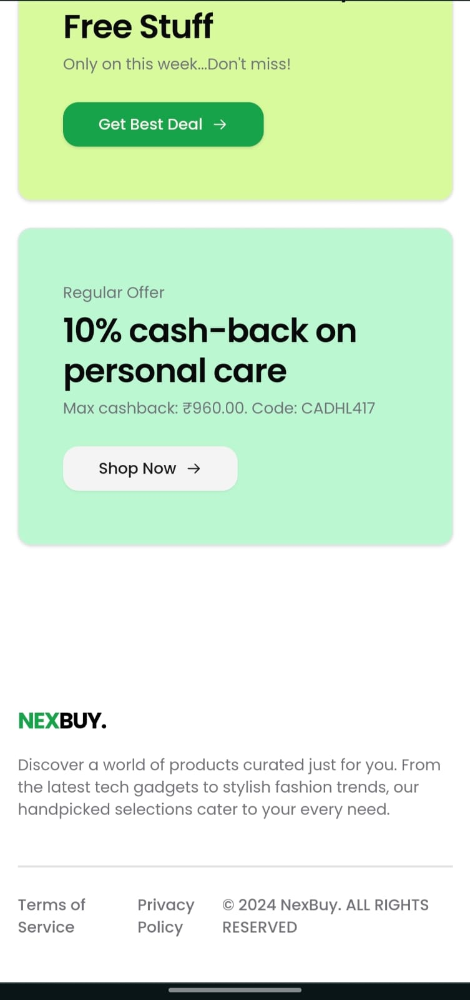

# NexBuy.

https://nexbuy.vercel.app/

## Table of Contents

- [Nexbuy](#project-name)
  - [Table of Contents](#table-of-contents)
  - [Getting Started](#getting-started)
    - [Prerequisites](#prerequisites)
    - [Installation](#installation)
    - [Running the Development Server](#running-the-development-server)
    - [Building the Project](#building-the-project)
    - [Screenshots](#screenshots)

## Getting Started

### Prerequisites

Ensure you have the following installed:

- [Node.js](https://nodejs.org/) (version 18 or higher recommended)
- [npm](https://www.npmjs.com/) (comes with Node.js) or [Yarn](https://yarnpkg.com/)

### Installation

1. Clone the repository:

   ```bash
   git clone https://github.com/khalid-09/nexbuy.git

   ```

2. Navigate to the project directory:

   ```bash
   cd nexbuy

   ```

3. Install the dependencies:

   ```bash
   npm i
   ```

   or if you are using yarn

   ```bash
   yarn

   ```

### Running the development server

```bash
  npm run dev
```

or if you are using yarn :

```bash
  yarn dev
```

### Screenshots

# Web View:


# Mobile view:

<div align="center">
  
  
</div>

<div align="center">
  
  
</div>

<div align="center">
  
  
</div>
